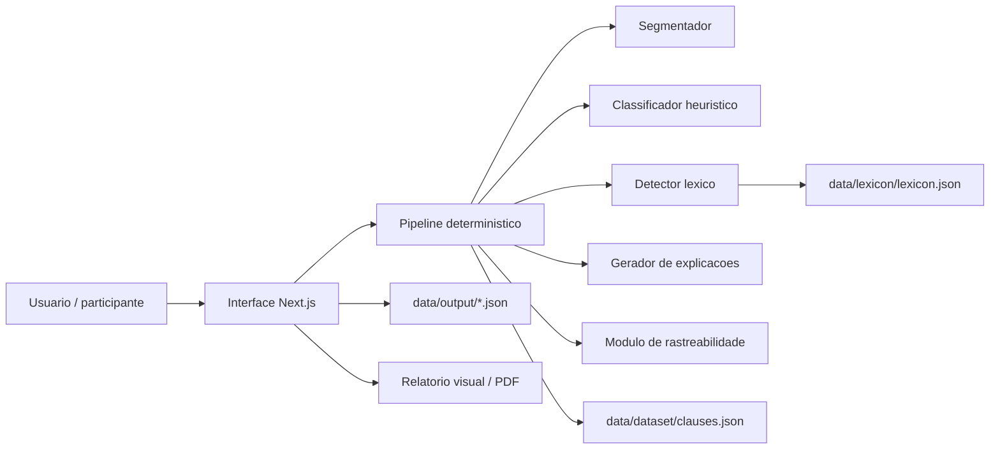

# C4 Simplificado

```mermaid
flowchart LR
    U[Usuario / participante] --> UI[Interface Next.js]
    UI --> P[Pipeline deterministico]
    P --> S1[Segmentador]
    P --> S2[Classificador heuristico]
    P --> S3[Detector lexico]
    P --> S4[Gerador de explicacoes]
    P --> S5[Modulo de rastreabilidade]
    S3 --> L[data/lexicon/lexicon.json]
    P --> D[data/dataset/clauses.json]
    UI --> O[data/output/*.json]
    UI --> R[Relatorio visual / PDF]
```

Uso sugerido no artigo: figura de componentes do sistema.
