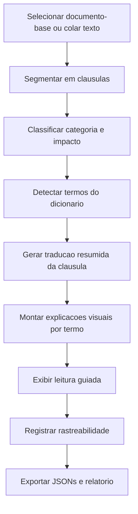

# Diagrama de Atividades

```mermaid
flowchart TD
    A[Selecionar documento-base ou colar texto] --> B[Segmentar em clausulas]
    B --> C[Classificar categoria e impacto]
    C --> D[Detectar termos do dicionario]
    D --> E[Gerar traducao resumida da clausula]
    E --> F[Montar explicacoes visuais por termo]
    F --> G[Exibir leitura guiada]
    G --> H[Registrar rastreabilidade]
    H --> I[Exportar JSONs e relatorio]
```

Uso sugerido no artigo: figura do fluxo principal do MVP.
